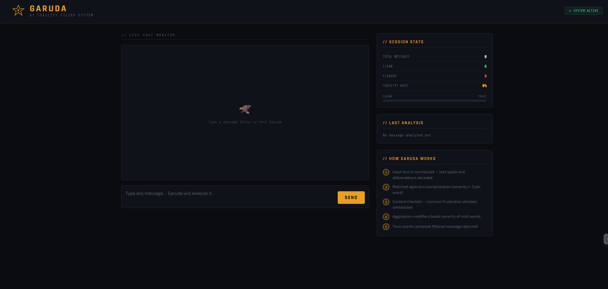
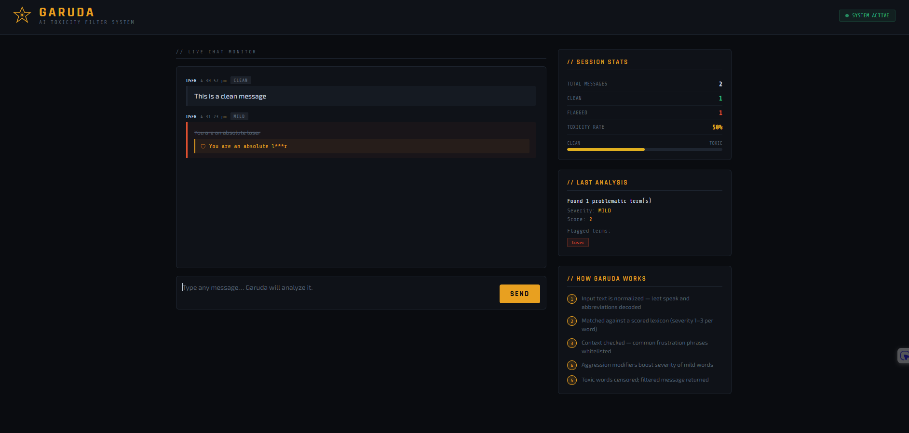

# Garuda - AI Chat Filter

Garuda is a web app I built that checks messages for toxic or abusive language and filters them out in real time. The idea came from seeing how college group chats can sometimes get really toxic, and I wanted to build something that could handle that automatically.

The name Garuda comes from Hindu mythology - the divine eagle, guardian figure. Felt like a good fit for something that watches over a chat space.

---

## What it does

- Takes any message as input
- Scores it based on how toxic it is (mild / moderate / severe)
- If the score is high enough, it censors the bad words and returns the cleaned version
- Shows a live dashboard with session stats

It also handles context - so something like casual frustration that college students say all the time won't get flagged, but actual directed insults will.

---

## Tech used

- Python + Flask (backend)
- HTML, CSS, JavaScript (frontend)
- Custom rule-based filter engine I wrote myself

---

## Folder structure

```
garuda/
├── app.py              # flask server
├── filter.py           # filter logic (the main brain)
├── requirements.txt
├── templates/
│   └── index.html      # the UI
└── README.md
```

---

## How to run it

Make sure Python is installed, then:

```bash
# install the only dependency
pip install flask

# run
python app.py
```

Open your browser and go to: `http://127.0.0.1:5000`

---

## How to use

Just type a message in the chat box and hit Send (or press Enter). Garuda will analyze it and show:
- Whether it's clean, mild, moderate or severe
- The censored version if it's flagged
- Stats for the whole session on the right side

---

## API

If you want to test it directly without the UI:

**POST /check**

Send:
```json
{ "message": "your text here" }
```

Get back:
```json
{
  "original": "your text here",
  "filtered": "your text here",
  "is_toxic": false,
  "severity_label": "clean",
  "score": 0,
  "flagged_words": [],
  "reason": "No issues found"
}
```

---

## How the filter works

1. Text is cleaned up - lowercased, leet speak decoded
2. Each word is matched against a scored word list
3. If the message is a common casual expression it gets whitelisted and passes
4. If aggressive context words are found, milder words get a higher score
5. If total score is 2 or more, message is flagged and censored

---

## 📸 Project Showcase

### Core Interface
The Garuda dashboard provides a real-time view of chat logs and toxicity metrics.


### Live Filtering Demo
This demo highlights the hybrid logic: casual slang is permitted, while targeted toxicity is automatically censored.


---

### 🚀 Key Features

* **Hybrid Filtering Logic**: Combines a weighted severity scoring system with a custom whitelist to reduce false positives.
* **Context-Aware Analysis**: Uses "Aggression Boosters" to detect when a mild word is being used as a directed insult.
* **Hinglish Support**: Specifically tuned to detect common toxic expressions in both English and Hindi code-mixed text.
* **Smart Normalization**: Utilizes Regular Expressions (`re`) to handle "leet speak" (e.g., @ instead of a) and extra whitespace bypass attempts.
* **Privacy-First Censorship**: Automatically applies partial masking (e.g., `a*****e`) to maintain readability while removing harm.

---

*BYOP submission - Fundamentals in AIML*
*Name: Vinayak Vishwkarma*
*Reg no. 25BCE10258*
*GitHub: https://github.com/vinayakv29/Garuda*
